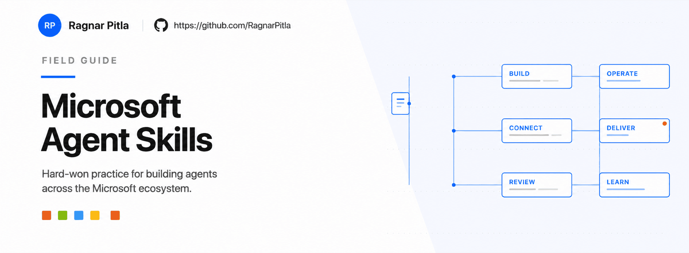

<p align="center">
  
</p>

# Microsoft Agent Skills

Skills for anything you need on the Microsoft ecosystem.

A skill is a folder with a `SKILL.md` in it: a piece of hard-won practice, written down once, that your coding agent loads when it is relevant. These cover the Microsoft stack specifically - Copilot Studio, Microsoft Foundry, Power Platform, Dynamics 365, Microsoft 365 Copilot, Work IQ, Scout and Azure.

**This repo is harness-agnostic by construction.** Most people working on this stack hold a GitHub Copilot licence rather than a Claude subscription, so GitHub Copilot is the primary target and Claude Code, Codex and Cursor are peers. `SKILL.md` is the single source of truth; every harness format is generated from it.

## Install

### Claude Code

The repo is its own single-plugin marketplace, so registering it and installing from it are two steps:

```
/plugin marketplace add RagnarPitla/microsoft-agent-skills
/plugin install microsoft-agent-skills@microsoft-agent-skills
```

The name appears twice because the plugin and the marketplace that carries it share a name. That is correct, not a typo.

Verify the manifests before publishing a change to either:

```
claude plugin validate . --strict
```

### GitHub Copilot

Copilot reads the [Agent Skills](https://code.visualstudio.com/docs/agent-customization/agent-skills) open standard natively - the same `SKILL.md` format this repo is written in - in VS Code, the Copilot CLI and the Copilot cloud agent. Clone the repo into your workspace, or copy the generated folder into your own:

```
git clone https://github.com/RagnarPitla/microsoft-agent-skills
cp -r microsoft-agent-skills/.github/skills .github/
```

Every skill appears as a slash command. Model-invoked skills also load themselves when the task matches their description; user-invoked ones carry `disable-model-invocation: true` and wait to be asked.

These are deliberately **not** shipped as `.instructions.md` files. An instructions file is applied by glob, and `applyTo: "**"` means always-on: every skill in this repo would be loaded into every request whether or not it was relevant, and an interview skill that is always applied does not wait to be asked. Two skills here warn about that failure in print, so the build must not commit it.

### Codex

Codex reads the same `SKILL.md` standard, from `<name>/SKILL.md` directories under `~/.codex/skills`. The generated tree is already in that shape, so copy it across:

```
git clone https://github.com/RagnarPitla/microsoft-agent-skills
cp -r microsoft-agent-skills/.github/skills/* ~/.codex/skills/
```

`agents/openai.yaml` is this repo's own manifest of which skills may be invoked implicitly. It is used by the validator, not by Codex - do not point a Codex config at it.

### Cursor

```
git clone https://github.com/RagnarPitla/microsoft-agent-skills
cp -r microsoft-agent-skills/.cursor/rules .cursor/
```

### Anything else

Every skill is a plain Markdown file at `skills/<bucket>/<name>/SKILL.md` with no harness-specific assumptions. If your tool can read a Markdown file into context, it can run these skills. Read the `SKILL.md` directly.

## The skills

Buckets are named for what you are doing, not for the Microsoft product involved, because Microsoft renames products constantly and a skill filed under a renamed product becomes unfindable.

### User-invoked

You reach for these by name.

- [ask-ragnar](./skills/deliver/ask-ragnar/SKILL.md) - not sure which skill you need? Start here.
- [choose-agent-platform](./skills/deliver/choose-agent-platform/SKILL.md) - work out which Microsoft platform an agent should be built on, and write down why.
- [discovery](./skills/deliver/discovery/SKILL.md) - a structured interview that pins down what you are actually building before you build it.

### Model-invoked

Your agent reaches for these on its own when the task fits.

- [copilot-studio-auth-patterns](./skills/connect/copilot-studio-auth-patterns/SKILL.md) - choose and debug authentication for a Copilot Studio agent, including which channels a choice forecloses and whether it can ever yield a token.
- [assess-change-blast-radius](./skills/review/assess-change-blast-radius/SKILL.md) - work out what a Power Platform or Copilot Studio change breaks somewhere else, before it ships.
- [copilot-studio-knowledge-grounding](./skills/build/copilot-studio-knowledge-grounding/SKILL.md) - diagnose and fix an agent that hallucinates, cites the wrong source, or answers inconsistently.
- [copilot-studio-production-patterns](./skills/build/copilot-studio-production-patterns/SKILL.md) - the patterns that separate a Copilot Studio agent that demos well from one that survives production.
- [de-slop](./skills/deliver/de-slop/SKILL.md) - rewrite text that reads like a model wrote it into something a person would actually send.
- [evaluate-agent-quality](./skills/review/evaluate-agent-quality/SKILL.md) - establish whether an agent works, and whether it still works, using a recorded eval set rather than ad hoc chats.
- [explain-concept](./skills/learn/explain-concept/SKILL.md) - explain a Microsoft ecosystem concept after diagnosing what the person actually misunderstands.
- [govern-agent-lifecycle](./skills/operate/govern-agent-lifecycle/SKILL.md) - decide whether an agent should still exist, who owns it, and whether it is governed the way production requires.
- [ground-agents-in-work-context](./skills/connect/ground-agents-in-work-context/SKILL.md) - choose the right grounding layer across the Microsoft IQ stack, and avoid the naming collision that sends people to the wrong one.
- [migrate-agent-to-skills](./skills/build/migrate-agent-to-skills/SKILL.md) - move a prompt-stuffed or legacy agent onto a portable skills-based harness without carrying its rot forward.
- [monitor-agent-telemetry](./skills/operate/monitor-agent-telemetry/SKILL.md) - set up the signals that tell you an agent is healthy and being used before a user has to report otherwise.
- [plan-agent-capacity-and-cost](./skills/operate/plan-agent-capacity-and-cost/SKILL.md) - work out whether an agent's message capacity, quota or spend is sized correctly before a limit or a bill surprises someone.
- [power-platform-alm-connection-refs](./skills/operate/power-platform-alm-connection-refs/SKILL.md) - fix and prevent solution imports that break on connection references, environment variables and flow ownership.
- [respond-to-agent-incidents](./skills/operate/respond-to-agent-incidents/SKILL.md) - triage and recover when a live agent is failing right now and users are affected.
- [review-copilot-studio-agent](./skills/review/review-copilot-studio-agent/SKILL.md) - review a Copilot Studio agent's YAML for defects that matter before it ships.
- [structured-interview](./skills/deliver/structured-interview/SKILL.md) - interview the user about a plan, design or decision until every open branch is resolved.
- [what-should-i-build](./skills/deliver/what-should-i-build/SKILL.md) - work out whether this needs an agent at all, and if so whether to consume one, govern the ones you have, or build.
- [write-a-skill](./skills/build/write-a-skill/SKILL.md) - write or repair an agent skill so it fires when it should and stays quiet when it should not.

## Buckets

| Bucket | What lives there |
| --- | --- |
| [build](./skills/build) | Creating an agent or solution on any Microsoft surface. |
| [connect](./skills/connect) | Wiring an agent to data, systems and tools: connectors, MCP servers, APIs. |
| [review](./skills/review) | Reviewing something that already exists: code, YAML, solutions, architecture, security. |
| [operate](./skills/operate) | ALM, testing, evaluation, governance, monitoring, cost, incident response. |
| [deliver](./skills/deliver) | The consulting layer: discovery, estimating, requirements, decisions, handoff. |
| [learn](./skills/learn) | Learning the stack yourself, and teaching it to others. |

## The registry

Being an honest index matters as much as the skills. Where Microsoft already solves something well, this repo routes to them and says so:

- [registry/microsoft-ecosystem.yaml](./registry/microsoft-ecosystem.yaml) - official Microsoft and community repositories worth linking to, including the archived ones you should stop recommending.
- [registry/connectors.yaml](./registry/connectors.yaml) - how to connect an agent to a given system, what it authenticates as, and what will bite you.

Both are link-checked, as is every URL cited inside a skill or docs page. A link that 404s costs more trust than a missing skill.

## Contributing

Start with [CONTRIBUTING.md](./CONTRIBUTING.md). It covers the bucket decision, the front matter, the sync obligations and what makes a review fail. [AGENTS.md](./AGENTS.md) is the same ground stated for a coding agent. [SECURITY.md](./SECURITY.md) covers how to report a vulnerability, and the [Code of Conduct](./CODE_OF_CONDUCT.md) sets expectations for participation.

Every gate runs on Node's standard library alone, so a fresh clone can check itself before installing anything. The only dependency is changesets, and it is needed for cutting a release rather than for verifying a change:

```
npm run build     # regenerate every harness artefact from SKILL.md
npm run check     # scrub gate, staleness, validation, freshness, version sync
npm run validate  # repo validation on its own
npm test          # fixture tests for the checks themselves

npm run refresh:stars  # re-pull registry star counts and archive flags from GitHub
```

Three things are enforced rather than trusted:

- **The scrub gate.** This is a public repo written by someone who works on real customer engagements. `npm run scrub` runs on every commit, and fails closed if its baseline denylist is missing. Read [.agents/confidentiality.md](./.agents/confidentiality.md) before publishing anything.
- **Accuracy.** Our readers spot a wrong CLI flag or an invented connector instantly, and that costs more credibility than a missing skill. Verify against `learn.microsoft.com` before writing it down, and say so where you could not. Every skill carries `verified_on` and `provenance`, and a weekly job opens an issue for anything overdue.
- **The checks themselves.** `npm test` breaks one rule at a time and asserts the gate fails. A gate nobody tests is a gate that quietly stops gating.

Also here: [SECURITY.md](./SECURITY.md), [CODE_OF_CONDUCT.md](./CODE_OF_CONDUCT.md), [CHANGELOG.md](./CHANGELOG.md).

## Who writes this

Ragnar Pitla - Principal PM on Microsoft's agentic team, and founder of [RBuild.ai](https://rbuild.ai).

These skills come out of real implementation work, which is why they are opinionated about
order and blunt about what does not work. Everything customer-specific is scrubbed before it
lands here; see [.agents/confidentiality.md](./.agents/confidentiality.md).

- [LinkedIn](https://www.linkedin.com/in/ragnarpitla) - where the thinking behind most of these skills gets argued out first
- [YouTube](https://www.youtube.com/@RagnarPitla) - longer walkthroughs
- [GitHub](https://github.com/RagnarPitla)

Views here are my own and do not represent Microsoft's official position.

## Licence

MIT. See [LICENSE](./LICENSE).
